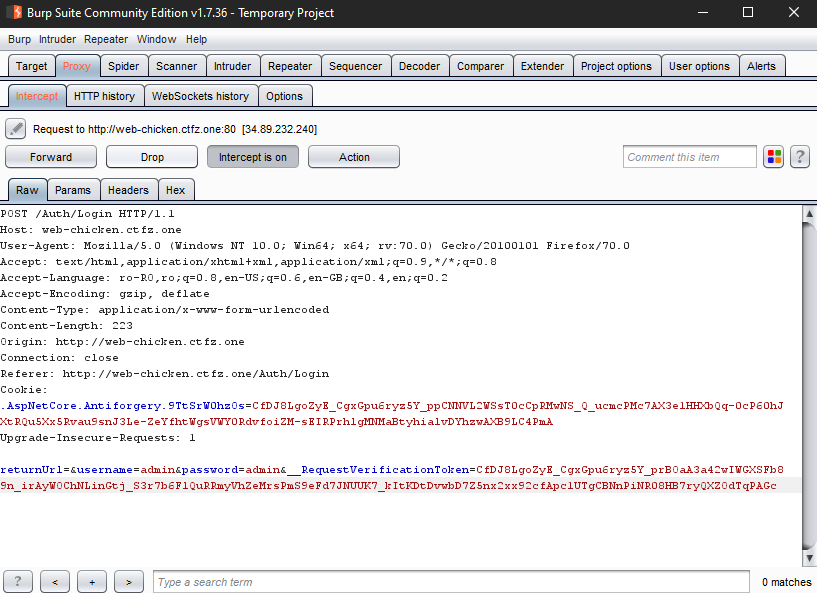
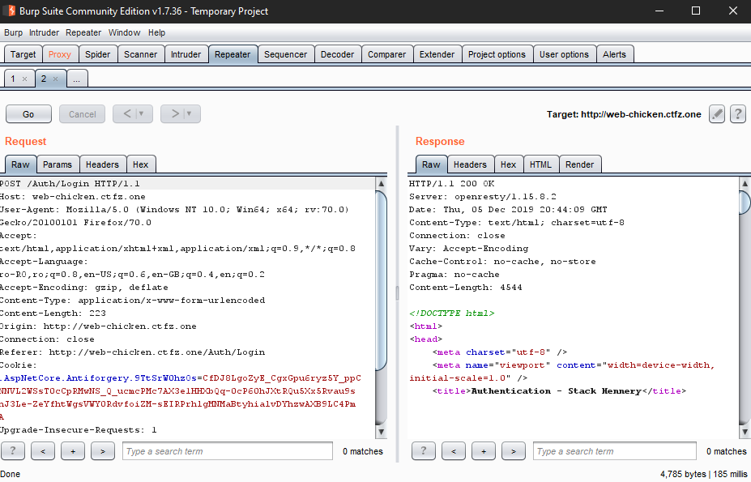
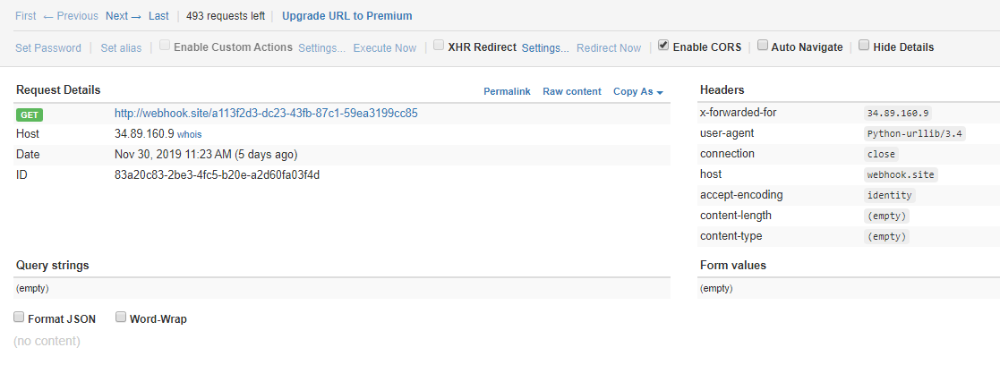
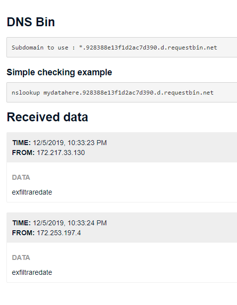

# Web basics


### Tools

##### Burp Suite Community Edition

Download:  https://portswigger.net/burp/communitydownload 

[Install si configurare]( https://support.portswigger.net/customer/portal/topics/718317-installing-and-configuring-burp/articles )

Browser recomandat: Mozilla Firefox, [configurare](https://support.portswigger.net/customer/portal/articles/1783066-configuring-firefox-to-work-with-burp)

Extensie utila: [FoxyProxy Standard]( https://addons.mozilla.org/en-US/firefox/addon/foxyproxy-standard/ )

Cele mai importante functii din Burp (pentru inceput): **Proxy** si **Repeater**

**Proxy**

- Ne permite sa interceptam request-urile HTTP si WebSocket in timp real
- Util pentru a vizualiza si modifica parametrii din request si pentru a schimba headerele de HTTP
- Odata interceptat pachetul, il putem trimite mai departe, ii putem da drop sau putem sa il trimitem in **Repeater** prin hotkey-ul **CTRL + R**
- Exemplu:



**Repeater**

- Fiecare request trimis in **Repeater** o sa fie in propriul lui tab
- Util pentru testare manuala de parametrii/headere/metode HTTP
- Raspunsul o sa apara in interfata Burp, nu in Browser
- Exemplu:
- 


##### Python

Doua biblioteci utile: **requests** si **urllib**

**requests** este in general mai usor de folosit

Sintaxa basic:

```python
import requests

URL = "http://127.0.0.1:5000"
login_url = URL + "/login.php"
sesiune = requests.Session() # daca vrem sa pastram cookie-ul intoarse de request-ul dat, folosim session. Daca nu ne intereseaza putem sa folosim direct requests.get() sau requests.post()

data = {'username':'admin','password':'admin'}
r = sesiune.post(login_url, data=data)
print r.status_code, r.headers, r.text # afiseaza codul de raspuns, headerele de raspuns si continutul intors
```

##### HTTP/DNS request bin

Site care stocheaza request-urile HTTP primite. Util pentru challenge-uri de tip XSS (unde trebuie sa furam cookie-ul adminului) sau atacuri blind (exfiltrare in command injection prin curl/wget)

Site recomandat: https://webhook.site/ (mai sunt si altele)

Interfata:



In cazuri mai speciale, server-ul poate avea blocat http-ul (iesire), putem folosi un DNS request bin pentru a face exfil la informatii. 

Site recomandat:  http://requestbin.net/dns (mai sunt si altele)

Cu un simplu request la exfiltraredate.928388e13f1d2ac7d390.d.requestbin.net avem:



##### Dirbuster

Gaseste fisiere/foldere ascunse pe site-uri prin bruteforce.

Un utilitar din linia de comanda este **dirb**

```
dirb http://127.0.0.1 wordlist.txt #daca nu este specificat wordlist.txt, dirb va rula cu un dictionar default
```


##### nmap

Scaneaza port-urile deschise al IP-ului dat, se va folosi flag-ul -p pentru porturi. Implicit el o sa scaneze cele mai comune 1000 de port-uri deschise

Exemplu de comanda:

``` 
nmap -sC -sV -oA fisier_out.txt 10.10.10.142
```


### Vulnerabilitati intalnite

##### OWASP Top 10 - 2017

1. Injection

   - SQL Injection
   - Command Injection
   - LDAP Injection
   - Server Side Templating Injection

2. Broken Authentication

   - Default credentials
   - Credential stuffing
   - Bruteforce credentials
   - Stolen credential re-use atatcks

3. Sensitive Data Exposure

   - Local file inclusion

4. XML External Entities (XXE)

   - Putem obtine LFI sau RCE (Remote code execution)

   - ```xml
     <?xml version="1.0" encoding="ISO-8859-1"?>
     <!DOCTYPE foo [
     <!ELEMENT foo ANY >
     <!ENTITY xxe SYSTEM "file:///etc/passwd" >]>
     <foo>&xxe;</foo>
     ```

5. Broken Access Control

   - Directory Listing
   - Access la API-uri fara autentificare
   - Metadata manipulation (ex. modificare de token-uri JWT)

6. Security Misconfiguration

   - Debug environment in Production
   - Information disclosure despre server/servicii in headere HTTP

7. Cross-Site Scripting (XSS)

   - Reflected XSS (vectorul de atac este un parametru din request)
   - Stored XSS (vectorul de atac este salvat remote, pe server)
   - DOM XSS (vectorul de atac este cauzat de o utilizare incorecta a functiilor din JavaScript ex. document.write() )

8. Insecure Deserialization

   - **PHP** Object Injection
   - **Java** [ysoserial]( https://github.com/frohoff/ysoserial )
   - **.NET** [ysoserial.net]( https://github.com/pwntester/ysoserial.net )

9. Using Components with Known Vulnerabilities

   - CVE-uri cunoscute pentru versiunea de software folosit de server

10. Insufficient Logging & Monitoring

    - Suspicious/Malicious accounts


### Link-uri utile

Web-CTF-Cheatsheet:  https://github.com/w181496/Web-CTF-Cheatsheet 

PayloadsAllTheThings:  https://github.com/swisskyrepo/PayloadsAllTheThings/ 
XSS-Cheatsheet:  https://portswigger.net/research/one-xss-cheatsheet-to-rule-them-all 

OWASP-Cheatsheet: https://cheatsheetseries.owasp.org/
